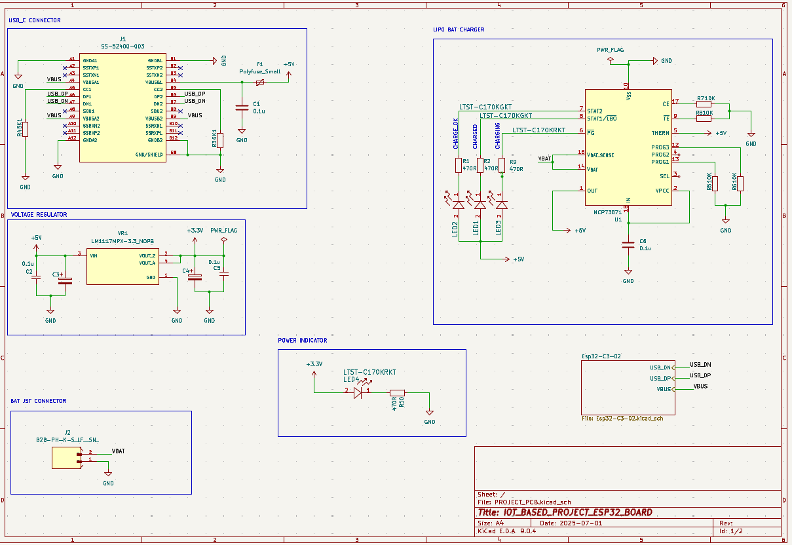
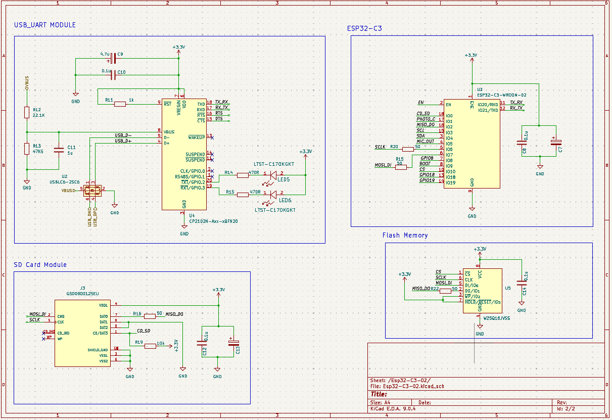

# ESP32 IoT 4-Layer PCB

This project focuses on the design and development of a **4-layer PCB** for an **ESP32-based IoT device**. The goal is to create a compact, robust, and EMI-optimized PCB layout suitable for IoT applications.

---

###### Power Management

###### Microcontroller, USB_UART, FLASH MEMORY AND SD CARD

## Project Overview

- **Microcontroller:** ESP32-WROOM-32 (or compatible module)
- **PCB Layers:** 4 (Signal–Ground–Power–Signal stackup)
- **Purpose:** General-purpose IoT hardware platform for prototyping and deployment
- **Tools Used:** KiCad (v6/v7), Git for version control

---

## Design Highlights

- **4-layer stackup** for improved signal integrity and reduced EMI
- Compact layout with modular headers for sensors and peripherals
- On-board voltage regulation (LDO or buck converter)
- USB-to-UART for programming and debugging
- Decoupling and impedance control best practices
- Optional: Antenna matching network for Wi-Fi/BLE

---

---

## Work in Progress

- [X] Schematic capture
- [X] 4-layer stackup definition
- [ ] Final PCB layout
- [ ] DRC/clearance verification
- [ ] Gerber export and fabrication
- [ ] Testing and validation

---

## Getting Started

1. Open the project in **KiCad v6 or later**
2. Explore `*.kicad_sch` and `*.kicad_pcb` files
3. Run DRC/ERC checks
4. Generate or review the BOM and Gerbers
5. Export fabrication files for PCB manufacturing

---

## Bill of Materials (BOM)

The complete BOM is available in [`Docs/PROJECT_PCB.csv`](Docs/PROJECT_PCB.csv). This file contains all components required for the PCB assembly, including quantities, values, footprints, and datasheets.

Key components include:
- **ESP32-C3-WROOM-02**: Main microcontroller module
- **CP2102N**: USB-to-UART bridge for programming
- **MCP73871**: Battery charging IC
- **W25Q16JVSS**: 16MB flash memory
- Various capacitors, resistors, LEDs, and connectors

---

## Documentation

- **Schematic PDF**: [`Docs/schematic.pdf`](Docs/schematic.pdf)
- **KiCad Project Files**: See `.kicad_sch` and `.kicad_pcb` files in the repository

---

## Previews

_3D renders, board stackup diagrams, or layout screenshots can go here_

---

## License

This project is open source under the **MIT License** (or specify yours).
Feel free to use, modify, and contribute.

---

## Contributions

Issues, suggestions, and pull requests are welcome!
If you'd like to contribute hardware improvements, please fork and submit a PR.

---

## Contact

Questions or feedback? Reach out via GitHub Issues or email: `daymondodari68@gmail.com`

